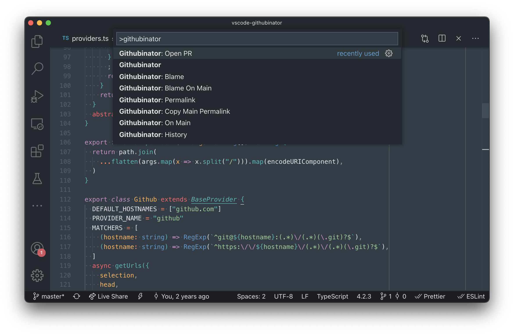

# [githubinator](https://github.com/chdsbd/vscode-githubinator) [](https://marketplace.visualstudio.com/items?itemName=chdsbd.githubinator#overview) [](https://github.com/chdsbd/vscode-githubinator/blob/master/LICENSE) [](https://circleci.com/gh/chdsbd/vscode-githubinator/tree/master)

VSCode plugin to quickly open files on Github and other providers. View Git blame information, copy permalinks and more. See the "commands" section of the README for more details.

## Install

### From online marketplace

Open the [online marketplace listing](https://marketplace.visualstudio.com/items?itemName=chdsbd.githubinator#overview) for Githubinator and click "Install". Follow the prompts to open VSCode and install Githubinator.

### From VSCode

In VSCode, type `CMD`+`P` and enter `ext install chdsbd.githubinator`. Or search for and install `chdsbd.githubinator` via the extensions tab.

### From Github release

Download the extension package from the [latest Github release](https://github.com/chdsbd/vscode-githubinator/releases/latest) and run `code --install-extension githubinator-*.vsix`

### From source

With `vsce` installed from NPM (`yarn global add vsce`), clone [this repo](https://github.com/chdsbd/vscode-githubinator) and run `vsce package`. Install the resulting package with `code --install-extension githubinator-*.vsix`

## Features



### Commands

| command                             | copy URL | open URL | mode           | SHA-type       |
| ----------------------------------- | :------: | :------: | -------------- | -------------- |
| `Githubinator`                      |    ✅    |    ❌    | blob           | current branch |
| `Githubinator: Copy`                |    ✅    |    ❌    | blob           | current branch |
| `Githubinator: Copy Main`           |    ✅    |    ❌    | blob           | "main" branch  |
| `Githubinator: Copy Permalink`      |    ✅    |    ❌    | blob           | current SHA    |
| `Githubinator: Copy Main Permalink` |    ✅    |    ❌    | blob           | "main" SHA     |
| `Githubinator: On Main`             |    ✅    |    ✅    | blob           | "main" branch  |
| `Githubinator: Permalink`           |    ✅    |    ✅    | blob           | current SHA    |
| `Githubinator: Blame`               |    ✅    |    ✅    | blame          | current branch |
| `Githubinator: Blame On Main`       |    ✅    |    ✅    | blame          | "main" branch  |
| `Githubinator: Blame Permalink`     |    ✅    |    ✅    | blame          | current sha    |
| `Githubinator: Repository`          |    ✅    |    ✅    | open repo      | N/A            |
| `Githubinator: History`             |    ✅    |    ✅    | open history   | N/A            |
| `Githubinator: Open PR`             |    ❌    |    ✅    | open PR        | N/A            |
| `Githubinator: Compare`             |    ✅    |    ✅    | compare branch | N/A            |

The "main" branch is configured via `githubinator.mainBranches` (see "Extension Settings" below).

## Requirements

- Local Git repository. You must have a git repository configured with a remote. (`"origin"` is default but this can be changed in settings).

## Extension Settings

- `githubinator.enable_context_menu`: Enable access to Githubinator commands from the context menu. (default: `true`)
- `githubinator.mainBranches`: Branch names to use as `main` repository branch. (default: `["main", "master", "trunk", "develop", "dev"]`)
- `githubinator.remote`: The default remote branch for a repository. (default: `"origin"`)
- `githubinator.providers.github.remote`: Remote name to look for when identifying a Github origin. (default: `"origin"`)
- `githubinator.providers.github.hostnames`: Hostnames for identifying a Github origin and building a URL. (default: `["github.com"]`)
- `githubinator.providers.gitlab.remote`: Remote name to look for when identifying a Gitlab origin. (default: `"origin"`)
- `githubinator.providers.gitlab.hostnames`: Hostnames for identifying a Gitlab origin and building a url. (default: `["gitlab.com"]`)
- `githubinator.providers.bitbucket.remote`: Remote name to look for when identifying a Bitbucket origin. (default: `"origin"`)
- `githubinator.providers.bitbucket.hostnames`: Hostnames for identifying a Bitbucket origin and building a url. (default: `["bitbucket.org"]`)
- `githubinator.providers.visualstudio.remote`: Remote name to look for when identifying a VisualStudio origin. (default: `"origin"`)
- `githubinator.providers.visualstudio.hostnames`: Hostnames for identifying a VisualStudio origin and building a url. (default: `["dev.azure.com"]`)

## Prior Art

This plugin is based on the [Sublime Plugin by ehamiter](https://github.com/ehamiter/GitHubinator) with the same name.

| project                                                                       | providers                               | blame | history | compare | permalink | master | copy | open | open-pr | one-step actions | provider autodetection |
| ----------------------------------------------------------------------------- | --------------------------------------- | :---: | :-----: | :-----: | :-------: | :----: | :--: | :--: | :-----: | :--------------: | :--------------------: |
| this project                                                                  | Github, Bitbucket, Gitlab, Visualstudio |  ✅   |   ✅    |   ✅    |    ✅     |   ✅   |  ✅  |  ✅  |   ✅    |        ✅        |           ✅           |
| [d4rkr00t/vscode-open-in-github][d4rkr00t-github] ([vscode][d4rkr00t-vscode]) | Github                                  |  ✅   |   ✅    |   ❌    |    ❌     |   ✅   |  ❌  |  ✅  |   ❌    |        ❌        |           ❌           |
| [ziyasal/vscode-open-in-github][ziyasal-github] ([vscode][ziyasal-vscode])    | Github, Bitbucket, Gitlab, Visualstudio |  ❌   |   ❌    |   ❌    |   ✅\*    |   ❌   |  ✅  |  ✅  |   ✅    |        ✅        |           ❌           |

\* changeable in settings between permalink and branch

[d4rkr00t-github]: https://github.com/d4rkr00t/vscode-open-in-github
[d4rkr00t-vscode]: https://marketplace.visualstudio.com/items?itemName=sysoev.vscode-open-in-github
[ziyasal-github]: https://github.com/ziyasal/vscode-open-in-github
[ziyasal-vscode]: https://marketplace.visualstudio.com/items?itemName=ziyasal.vscode-open-in-github

## Development

```sh
# install dependencies
make install
# lint (tslint and formatting)
make lint
# format code
make format
# check formatting
make format-ci
# run tests
make test
# run linting and testing
make test-ci
```

### VSCode instructions

#### Get up and running straight away

- Press `F5` to open a new window with your extension loaded.
- Run your command from the command palette by pressing (`Ctrl+Shift+P` or `Cmd+Shift+P` on Mac) and typing `Hello World`.
- Set breakpoints in your code inside `src/extension.ts` to debug your extension.
- Find output from your extension in the debug console.

#### Make changes

- You can relaunch the extension from the debug toolbar after changing code in `src/extension.ts`.
- You can also reload (`Ctrl+R` or `Cmd+R` on Mac) the VS Code window with your extension to load your changes.

#### Run tests

- Open the debug viewlet (`Ctrl+Shift+D` or `Cmd+Shift+D` on Mac) and from the launch configuration dropdown pick `Extension Tests`.
- Press `F5` to run the tests in a new window with your extension loaded.
- See the output of the test result in the debug console.
- Make changes to `test/extension.test.ts` or create new test files inside the `test` folder.
  - By convention, the test runner will only consider files matching the name pattern `**.test.ts`.
  - You can create folders inside the `test` folder to structure your tests any way you want.

### Publish

```bash
vsce package
vsce login chdsbd
vsce publish <version>
```

[marketplace]: https://marketplace.visualstudio.com/items?itemName=chdsbd.githubinator

### Logo

Based on the [Git Logo](https://git-scm.com/downloads/logos) by [Jason Long](https://twitter.com/jasonlong), licensed under the [Creative Commons Attribution 3.0 Unported License.](https://creativecommons.org/licenses/by/3.0/).
